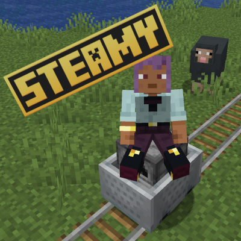
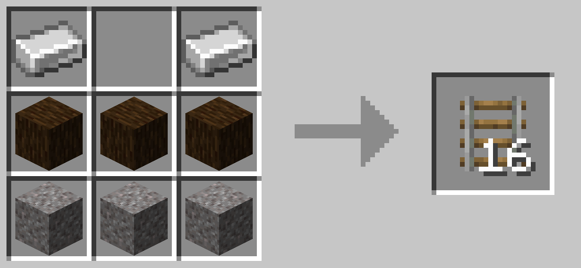
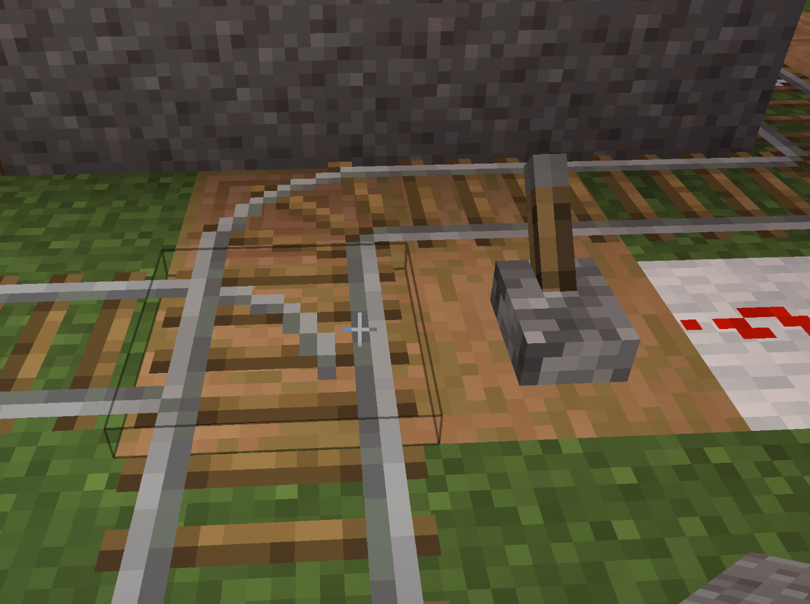

# Steamy Mod for Minecraft NeoForge

This mod features locomotives, aka rideable furnace minecarts and cheaper regular rails.

# Vehicles

## Locomotives

### Build it?

Add a lever on top of a furnace minecart.

### Load it?

Runs on furnace minecart fuel.

### Control it?

Press jump (space) to increase throttle and left ctrl to decrease throttle. Otherwise, the locomotive is controlled like a
regular minecart.

# Rails

## Cheaper Rails

Rails can be crafted from iron ingots, logs and gravel.

## Switch Rails

Switch rails can be flipped using redstone, preferably with a lever.

## License

### Source Code / java files

LGPLv3
https://www.gnu.org/licenses/lgpl-3.0.en.html

This mod is sponsored by [Agile Unicorn](https://agile-unicorn.com/).

